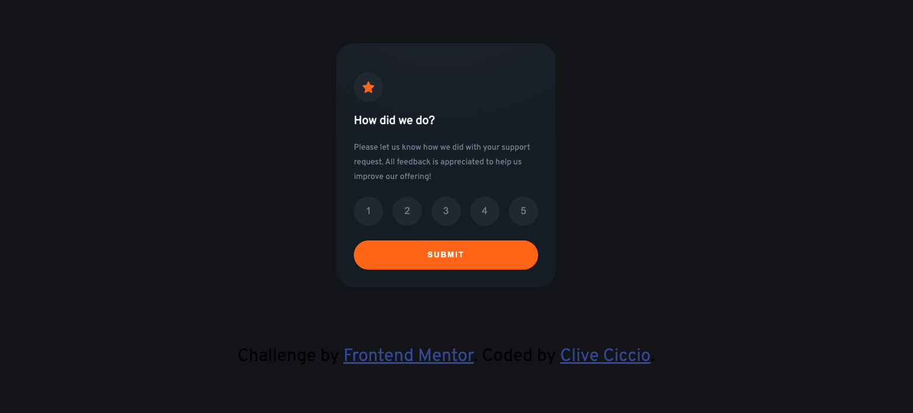

# Frontend Mentor - Interactive rating component


## Welcome! 👋

Thanks for checking out this front-end coding challenge.

[Frontend Mentor](https://www.frontendmentor.io) challenges help you improve your coding skills by building realistic projects.

## Overview

### The challenge

Users should be able to:

- View the optimal layout for the app depending on their device's screen size
- See hover states for all interactive elements on the page
- Select and submit a number rating
- See the "Thank you" card state after submitting a rating

### Screenshot

Here is my solution



### Links

- Solution URL: (https://github.com/clivepato93/Interactive-rating-component)
- Live Site URL: (https://clivepato93.github.io/Interactive-rating-component/)

## My process

### Built with

- Semantic HTML5 markup
- CSS custom properties
- Flexbox
- Mobile-first workflow
- JS

### What I learned

I learned how to overcome event listeners not working on Safari ios as the functionality was working everywhere else.

I adjusted my div's from

```html
    <div class="btn">1</div> 
```
```html
    <button class="btn" value="1">1</button> 
```

```css
    .btn{
        border-radius: 50%;
        width: 5rem;
        height:5rem;
        background-color: var(--dark-blue);
        color: var(--medium-grey);
        display: flex;
        justify-content: center ;
        align-items: center;
        font-size: 1.7rem;
        cursor:pointer;
        border: 2px solid var(--dark-blue);
    }

```


### Continued development

Use this section to outline areas that you want to continue focusing on in future projects. These could be concepts you're still not completely comfortable with or techniques you found useful that you want to refine and perfect.

### Useful resources

- [Resource 1](https://stackoverflow.com/questions/57334793/touch-click-and-input-event-listeners-not-firing-ios) - This helped me for regarding my Safari ios issue

## Author

- Website - [Add your name here](https://www.your-site.com)
- Frontend Mentor - [@clivepato93](https://www.frontendmentor.io/profile/clivepato93)
- Twitter - [@ciccio_ct93](https://www.twitter.com/ciccio_ct93)


